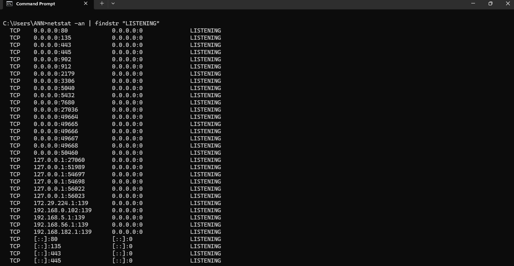

# Defensive Security (Intro)

Theory
If Offensive is “find the hole,” Defensive Security is “find the hole, fix it, and make sure nobody gets in again.”

Defenders are called Blue Team, SOC Analysts (Security Operations Center), Incident Responders and etc.

The 5 core defensive activities:

1. Monitoring: Watching logs, traffic, and alerts ,Using a SIEM (like Splunk) to see failed login spikes
2. Vulnerability Management: Finding and patching weaknesses ie. Running a scan with OpenVAS, then updating software
3. Hardening: Making systems more secure ie. Disabling unused ports, enforcing strong passwords
4. Detection: Figure out if an attack is happening ie. Seeing a reverse shell beaconing out every 60 seconds
5. Incident Response: Contain and recover from an attack ie. Isolating a hacked laptop, restoring from backup

The Mindset Difference:
Offensive: "How can I break this?"

Defensive: "How could someone break this, and how do I stop or detect it?"

 
## Quick Quiz 

1. If you see 100 failed login attempts in 2 seconds, is that an offensive or defensive observation? Why?

Failed login spike is a defensive observation because you're monitoring logs to detect an attack in progress.

2. True or False: A defender never needs to know how offensive attacks work.

False :  Defenders must understand offensive techniques to know what to look for.

3. Give one example of a defensive action you could take right now on your own computer.

 Turning on your firewall, using a strong password, or enabling automatic updates.

---

### Hands‑on Task 

On Windows:
Open Command Prompt as Administrator and run:

- netstat -an | findstr "LISTENING"

On Linux:
Open Terminal and run:

-  netstat -an | grep LISTEN

What this does: Shows you all the open "listening" ports on your machine and doors that could be attacked.

Questions for you:

1. How many listening ports did you find?

  3 listening ports

2. Pick one port number (like 443 or 22). Do a quick web search: what service normally uses that port?

 443 : HTTPS 22: SSH (Secure Shell)

3. If you were a defender, would you want to know every listening port on your network? Why?

 Yes because it shows where an attacker can attack(attack surface)

