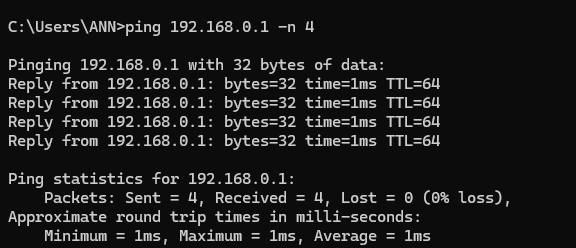

# Intro to LAN

Theory 

LAN = Local Area Network

A network in a small area (home, office, coffee shop) where devices can talk directly without going through the internet.

Key LAN facts :

1. Broadcast: A message sent to all devices on the LAN	(ARP spoofing, network discovery)
2. Collision domain:Old tech (hubs) — now switches eliminate this	
3. Switches: Forward traffic only to the correct device (by MAC)	
4. Routers:	Connect your LAN to other networks (including internet)	The "gateway" — often your first target

LAN cheat sheet:

Devices on same LAN → can:

- ARP spoof (pretend to be the router)
- Discover each other (nmap -sn)
- Sniff unencrypted traffic (if switch isn't secure)
- Broadcast attacks (like DHCP starvation)

Devices on different LANs → must go through a router

Your LAN right now:

- Your IP 192.168.0.102 and your router is likely 192.168.0.1

---

## Quick Quiz

1. Can a hacker in Tokyo directly ARP spoof your computer on your home LAN? Why or why not?

Why not : ARP is local only — never crosses a router.

2. If two devices have IPs 192.168.1.5 and 192.168.2.10, are they on the same LAN? Why?

No they aint on the same LAN. They have different third octets (1 vs 2). That usually means different networks/subnets. A router sits between them.

3. What device connects your LAN to the internet?

Router

---

### Hands‑on Task (do this now — very useful for hacking)

---

Find your router's IP (gateway)

- Windows:

cmd

ipconfig | findstr "Default Gateway"

- Linux:

bash
ip route | grep default

bash
ping [your router IP] -c 4   # on Linux

ping [your router IP] -n 4   # on Windows

Questions for you:

1. What is your default gateway (router) IP?

192.168.0.1

2. Did the ping succeed? What does that tell you?

The router responsive

TTL=64 suggests it's a Linux-based router (common)

1–3ms latency is excellent

3. If you wanted to ARP spoof your entire LAN, which IP would you target first?

The router (gateway) is the prime target for ARP spoofing because all traffic to the internet passes through it.