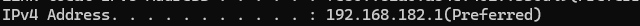

# What is Networking?

Theory 

A network = two or more devices connected so they can share data.

In cybersecurity, networks matter because:

- Attacks move across networks (worms, lateral movement)

- You attack over a network (remote exploits)

- You defend network traffic (firewalls, IDS)

Two types of addresses you MUST know:

1. IP Address - Logical address (can change) ie. 192.168.1.5 (Your street address)
2. MAC Address - Physical address (burned into device, never changes) ie. 00:1A:2B:3C:4D:5E	(Your fingerprint)

Quick rule:

- IP addresses help you find a device.
- MAC addresses help you identify a device uniquely.

---

## Quick Quiz 

---

1. If you move your laptop from a coffee shop to your home, does your IP address change? Does your MAC address change?

IP (YES) is leased (DHCP), MAC (NO) is burned into the NIC.

2. Why would a hacker want to spoof (fake) their MAC address?

 MAC filtering is weak security, but some networks use it. Spoofing bypasses it.

3. True or False: Every device on the internet has a unique MAC address visible to any other device online.

FALSE : MAC addresses never leave your local network (Layer 2). The internet only sees IPs.

---

### Hands‑on Task 

---

On Windows (Command Prompt):

cmd

ipconfig /all

On Linux (Terminal):

bash
ifconfig

- Your IPv4 address (looks like 192.168.x.x or 10.x.x.x)
- Your MAC address (called "Physical Address" on Windows, "ether" on Linux/Mac — looks like six pairs of hex digits)

Write down :

1. Your device's current IPv4 address

192.168.182.1

2. Your device's MAC address

00-50-56-C0-00-08

3. Does your IP start with 192.168 or 10. or something else?

192.168 

Why this matters for offensive security:

- Scanning tools like nmap discover IP addresses first
- MAC spoofing helps you avoid tracking on local networks
- Understanding addressing = understanding how to move laterally after a breach