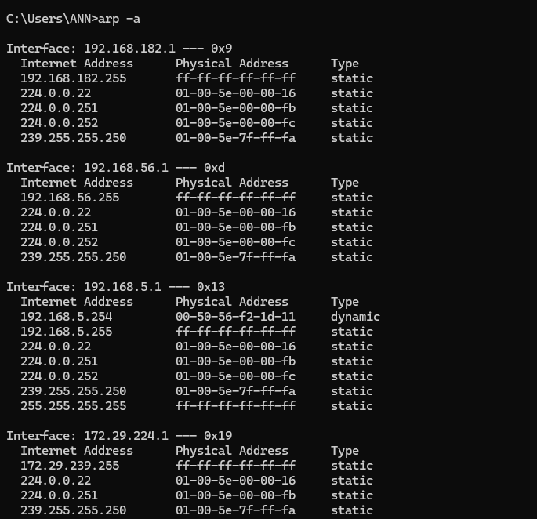

# OSI Model

Theory 

The OSI Model has 7 layers. Most only care about Layers 2–4 and 7.

7 layers of OSI Model

7	Application : HTTP, DNS, SMTP (user-facing /interacting with the apps) - Web attacks, phishing, SQLi

4	Transport: TCP/UDP (ports, reliability)	- Port scanning, SYN floods

3	Network: IP, routing (packets)- IP spoofing, routing attacks

2	Data Link: MAC addresses, switches (frames)	- ARP spoofing, MAC flooding

1	Physical: Cables, radio frequencies	- Evil maid attacks, wardriving

The mnemonic to use:

"Please Do Not Throw Sausage Pizza Away"

(Physical, Data Link, Network, Transport, Session, Presentation, Application)

Why OSI is Important :

- Attack a higher layer = more complex but more damage.
- Attack a lower layer = simpler but local only.

Example:

1. ARP spoofing (Layer 2) works only on your LAN
2. SQL injection (Layer 7) works anywhere 

---

## Quick Quiz 

---

1. Which layer deals with IP addresses?

Layer 3

2. Which layer deals with ports like 80 (HTTP) or 443 (HTTPS)?

Layer 4 (scans ports at Layer 4)

3. If you send a phishing email, which OSI layer are you primarily attacking? Why?

Layer 7 (it manipulates the user at the Application layer)

4. True or False: Wireshark (packet sniffer) captures data from Layer 2 up to Layer 7.

True ( it captures from MAC headers (L2) up to application data (L7))

---

### Hands‑on Task

---

Open your terminal and run:

bash

 Windows:

arp -a

Linux:

arp -n

- This shows your ARP table — what your computer knows about other devices on your LAN.

Questions for you:

1. How many devices does your ARP table show?

5 devices on your LAN

2. What's the MAC address of your router (192.168.0.1)?

50-0f-f5-a9-d5-68

3. Why would a hacker want to poison this ARP table?

ARP spoofing lets you intercept, modify, or drop traffic. You become the "man in the middle."