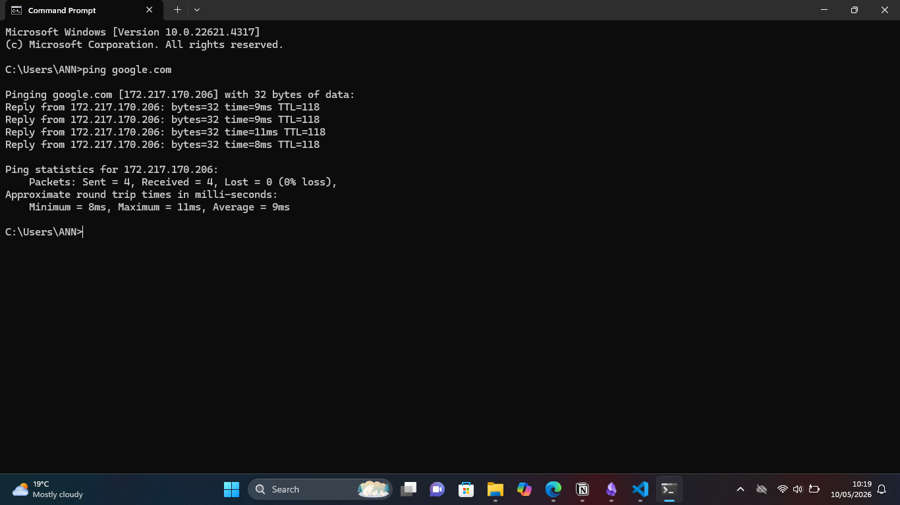
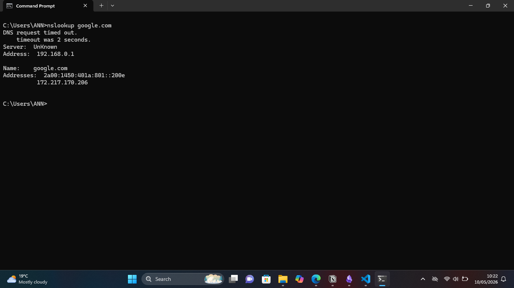

# Offensive Security (Intro)

Theory

Offensive Security = authorized attacking.
Think: "ethical hacking," "red team," "penetration testing."

The goal is to find weaknesses before the bad guys do.

The 5 core stages (simplified):

1. Reconnaissance: Gathering info about the target ie. Finding employee names on LinkedIn.
2. Scanning and Enumeration: Probing the target for details	nmap to see which services are running ie. scanning for open ports
3. Gaining Access: Exploiting a vulnerability ie.Using a weak password or unpatched software to get in
4. Maintaining Access: Keeping a foothold ie. Installing a backdoor or reverse shell
5. Covering Tracks: Erasing evidence ie. Clearing logs, hiding files

Important rule:

Offensive security is only legal with explicit written permission. Otherwise it's a crime.

---
## Quick Quiz 

1. What's the main difference between an "ethical hacker" and a "malicious hacker"?

ethical hacker performs offensive security legally while malicious hacker performs illegally the offensive security

2. If you find a vulnerability in a company's website and report it without permission, is that offensive security? Why or why not?

Its not offensive this is illegal which can lead to a crime .

---
### Hands‑on Task 

 Open your computer's terminal (Command Prompt on Windows, or Terminal on Mac/Linux).

Run this command:

- ping google.com

 

- nslookup google.com

Questions to answer after running :

1. What IP address did ping show for google.com?

216.58.223.78

2. What did nslookup tell you that ping didn't?

gave you the official DNS records

3. In the "Reconnaissance" stage, why would an attacker start with commands like these?

Reconnaissance helps an attacker map out what lives where before they try anything aggressive